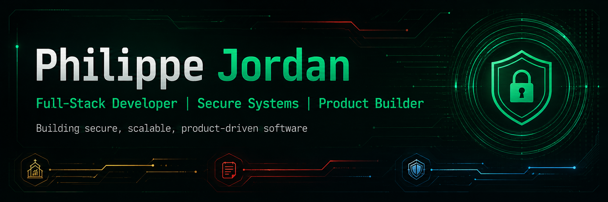

<!-- =========================================================
     PHILIPPE JORDAN — GITHUB PROFILE
     Full-Stack • Secure Systems • Product Builder
========================================================= -->

<p align="center">
  
</p>

<p align="center">
  
</p>

<p align="center">
  
  
</p>

<p align="center">
  <a href="#">
    
  </a>
  <a href="www.linkedin.com/in/philippe-mba-12547a288">
    
  </a>
  <a href="mailto:philippemonf@yahoo.com">
    
  </a>
  <a href="https://github.com/PhilJordan18">
    
  </a>
</p>

<p align="center">
  
  
</p>

---

## 👨‍💻 About Me

I'm **Philippe Jordan**, a full-stack software developer focused on building
secure, maintainable, and product-oriented applications.

- 🔐 Creator of **NexusVault**, a security-focused password management platform
- 🏗️ Strong interest in **backend engineering, software architecture, and cybersecurity**
- 🌐 Building full-stack applications with **Laravel, Next.js, React, ASP.NET, PostgreSQL, and Supabase**
- 🐳 Comfortable taking projects beyond development through **Docker, Linux, VPS deployment, and production tooling**
- 🎓 Final-year **Computer Science Technology — Web & Mobile Development** student at Cégep de Sorel-Tracy
- 🌱 Currently expanding into **Spring, Modern C++, and game development**
- ⚙️ I care about more than making software work — I care about **how it is structured, secured, deployed, and maintained**

---

## 🛠️ Tech Stack

### 💻 Languages

<p>
  
  
  
  
  
  
  
  
  
</p>

### 🎨 Frontend

<p>
  
  
  
  
  
  
</p>

### ⚙️ Backend & Databases

<p>
  
  
  
  
  
</p>

### 🔐 Security

<p>
  
  
  
  
  
</p>

### ☁️ Cloud, DevOps & Tooling

<p>
  
  
  
  
  
</p>

---

# 🚀 Featured Projects

<table>
<tr>
<td width="50%" valign="top">

## 🔐 NexusVault
<a href="https://nexusvault.dev">
 
</a>

A security-focused password management platform designed around modern
authentication and encrypted credential storage.

**Highlights**

- Multi-factor authentication
- WebAuthn & Passkeys
- OAuth authentication
- Encrypted vault data
- Secure key-management architecture
- Production deployment

**Stack**

`Laravel` `PHP` `PostgreSQL` `WebAuthn` `Docker` `Linux`

<a href="https://github.com/PhilJordan18/NexusVault.git">
  
</a>

</td>

<td width="50%" valign="top">

## ⛪ FinanceRDP


A role-based finance management platform designed to organize contributions,
expenses, approvals, reporting, and administrative workflows.

**Highlights**

- Role-based access control
- Contribution management
- Administrative approval workflows
- Financial reporting
- Secure database policies

**Stack**

`Next.js` `React` `TypeScript` `Supabase` `PostgreSQL`

<a href="LIEN_REPO_FINANCERDP">
  
</a>

</td>
</tr>

<tr>
<td width="50%" valign="top">

## 📝 EZNotes


A collaborative note-management application focused on structured content,
clean backend architecture, and an efficient user experience.

**Focus**

- Notes & organization
- Structured backend logic
- RESTful architecture
- Relational data
- Collaborative workflows

**Stack**

`ASP.NET` `C#` `Entity Framework Core` `PostgreSQL`

<a href="LIEN_REPO_EZNOTES">
  
</a>

</td>

<td width="50%" valign="top">

## 🛡️ AegisFlaw


A security-oriented project centered around vulnerability analysis,
defensive engineering, and understanding how systems fail.

**Focus**

- Vulnerability analysis
- Defensive engineering
- Security research
- Threat-oriented thinking
- Secure system design

**Identity**

`Silver` `Steel Blue` `Security`

<a href="LIEN_REPO_AEGISFLAW">
  
</a>

</td>
</tr>
</table>

---

## 🎯 Current Focus

```text
> BUILDING
  Secure full-stack applications
  Maintainable backend systems
  Product-oriented software

> IMPROVING
  Software architecture
  Backend engineering
  Security-first development

> EXPLORING
  Spring
  Modern C++
  Game Development
